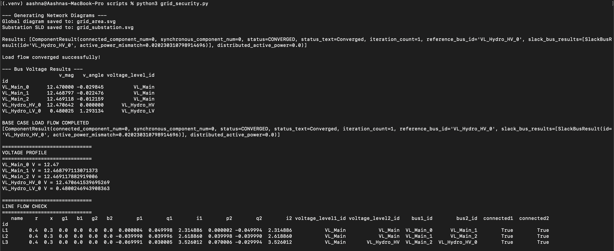
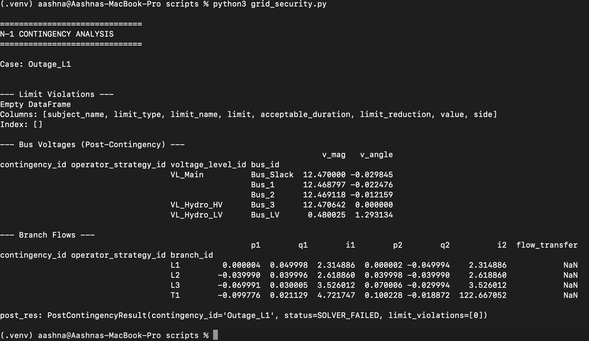
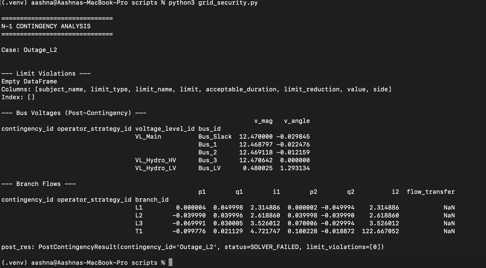
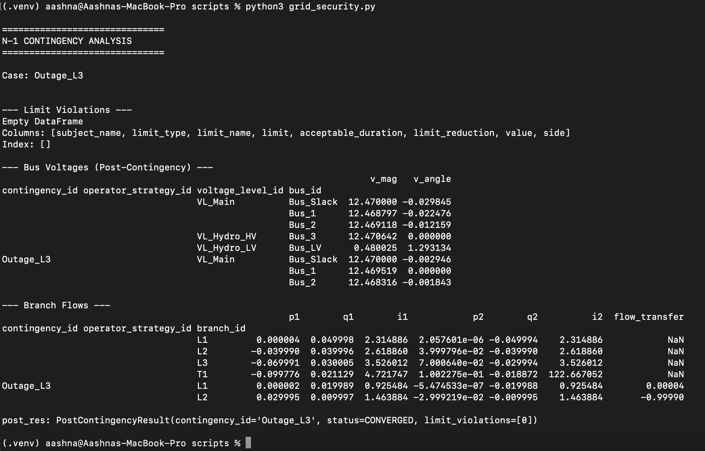
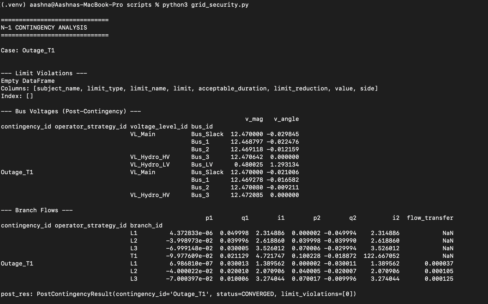
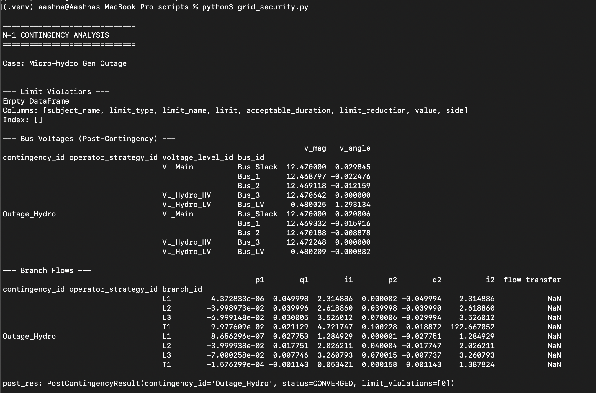

# MICRO-HYDROPOWER DESIGN PART III - FAULT PROTECTION & CONTINGENCY MODELLING
> This projects build on [Part I - Site Assessment](https://github.com/aa-sharma/micro_hydro_bc) and [Part II - Grid Integration & Power System Modelling](https://github.com/aa-sharma/micro_hydro_bc_II/tree/main) where we identified candidate locations for a micro-hydropower plant in rural Southwest British Columbia and conducted load flow analysis for a 100kW plant.
We will now conduct a simiplified grid security and protection analysis using PowSyBl for contingency and outage analysis. We will then apply foundational protection and reliability concepts relevant to distribution interconnection using the IEEE 1547 standards as a guide.

#### Network Area Diagram

 

#### Single Line Diagram

 

## Simulation
The pypowsybl library in python is used for simulation.

### Load Flow Validation (Base Case)
 
Since this simulation converged, we can conclude that the base case is stable under normal operating conditions.

### N-1 Contingency Analysis
#### Case 1: Line Outages
##### 1.1: Line 1 Outage (Bus_Slack - Bus1)
This simulation models the behaviour when the main feeder (or primary transmission line) is disconnected from the Slack (external grid)

 

The simulation does not converge (SOLVER_FAILED). Due to the radial topology, when line 1 fails, all components downstream loses connection to the slack bus. Without the reference bus (slack) and a secondary path to the external grid, the simulation fails because the power can no longer be balanced in the subsequently formed island.

##### 1.2: Line 2 Outage (Bus1 - Bus2)
This simulation models the behaviour when the internal trunk line between local load centers fails

 

The results for this case can be interpreted in the same way as for case 1.1.

##### 1.3: Line 3 Outage (Bus2 - Bus3)
This simulation models the behaviour when the dedicated feeder connecting the micro-hydro generator is disconnected

 

This simulation converges. L3 is the link to the micro-hydro substation which fails but the rest of the grid (bus 1 and 2) stay online.

#### Case 2: Transformer Outage

 
The simulation converges, indicating that a transformer outage isolates the micro-hydro generator from the the rest of the utility grid while the HV side continues to function with stability.

#### Case 3: Generator Outage

 
The simulation converges, demonstrating that when the micro-hydro generator trips, the external grid picks up the extra load and the voltages stay relatively stable.

#### Summary of N-1 Contingency Analysis

| Contingency| Result | System Impact |
| ---------- | ----- | ----------|
| L1 Outage | Critical Failure | Blackout (main feeder lost) |
| L2 Outage | Critical Failure | Partial supply interruption (disconnect from grid) |
| L3 Outage | OK | Localized outage (only micro-hydro substation impacted) |
| T1 Outage | OK | Localized outage (LV bus impacted) |
| Micro-hydro Gen Outage | OK | Operational change (slack compensates for lost generation) |

## Proposed Protection Schemes

### Ring Topology
Implementing a ring topology instead of a radial topology, where either Bus2 or Bus3 is also connected back to the Slack bus via  a separate path ensures N-1 compliance. Even if a line in the loop fails, the micro-hydro plant will still be able to export power to the grid.

### Anti-Islanding

